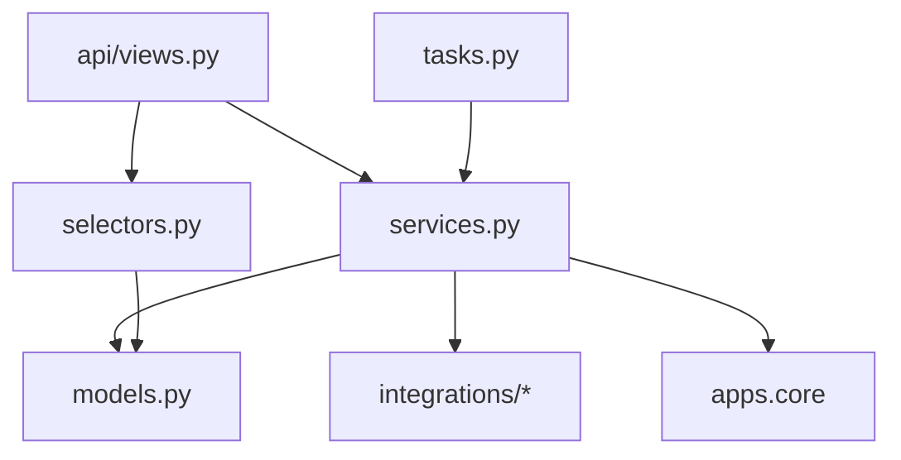

# Backend architecture

Python 3.13, Django 5.2 LTS, Django REST Framework, drf-spectacular, Celery, PostgreSQL 17, Redis.
Dependencies are managed with `uv`.

## Project layout

```
backend/
|-- pyproject.toml          # dependencies + ruff, mypy, pytest, import-linter config
|-- manage.py
|-- config/
|   |-- settings/base.py    # shared defaults, reads env with django-environ
|   |-- settings/local.py   # DEBUG, local S3 profile
|   |-- settings/test.py    # fast password hasher, in-memory storage adapter, eager Celery
|   |-- settings/production.py
|   |-- urls.py             # /api/health, /api/v1/, /admin/
|   |-- celery.py
|   `-- wsgi.py
|-- apps/
|   |-- core/               # shared building blocks, no domain logic
|   |-- accounts/           # User, login/logout/me
|   |-- crews/              # Crew, Member, Invite, switching crews
|   |-- challenges/         # Challenge (soft deleted), Participant, Vote; windows.py: what each window needs
|   |-- checkins/           # CheckIn, CheckInEntry; days.py: day states, verdicts, streaks
|   |-- media/              # Upload (straight to S3), Transcode (renditions), media links; knows no challenges
|   |-- proofs/             # Proof on any subject (generic key): uploads, parts, transcoding, expiry
|   |-- doom/               # Spin: the Wheel of Doom (open, draw, serve); builds on check-ins and proofs
|   |-- journal/            # The crew's journal: check-ins and drawn spins (the top: nothing imports it)
|   `-- reactions/          # Reaction on any registered target (generic key); knows no challenges or check-ins
|-- integrations/
|   |-- storage/            # ObjectStorage ABC (presigned PUT/GET, multipart, head, delete), S3, in-memory, factory
|   |-- transcoding/        # Transcoder ABC, MediaConvert (job settings in code), in-memory, factory
|   `-- cdn/                # CloudFront URLs and signed cookies (production); None locally
|-- tests/
|   `-- factories/          # factory-boy factories, one module per app
`-- conftest.py             # fixtures for every test: api_client, user, auth_client, object_storage
```

## Layers inside an app

```
apps/crews/
|-- models.py        # fields, constraints, small computed properties
|-- services.py      # writes: create_crew_with_admin, create_invite, accept_invite, switch_crew
|-- selectors.py     # reads: get_active_member, list_members, list_pending_invites
|-- api/
|   |-- serializers.py
|   |-- views.py
|   `-- urls.py
|-- admin.py
|-- tasks.py
|-- migrations/
`-- tests/
```



### Rules

1. **Views are thin.** Validate input with a serializer, call one service or selector, serialize
   the result. No ORM writes, no business decisions.
2. **Services own every write and rule.** Keyword-only, typed arguments; return model instances or
   small dataclasses; wrap multi-step writes in `transaction.atomic()`.
3. **Selectors own non-trivial reads.** They return querysets or lists with the right
   `select_related` / `prefetch_related` so views never cause N+1 queries.
4. **Apps talk through services and selectors,** never by writing another app's models.
5. **Integrations are adapters.** An abstract base class defines what the app needs; concrete
   classes implement it; a factory picks one from settings. Only `integrations/` imports `boto3`
   or `pywebpush`.
6. **Tasks are thin and idempotent.** They take ids, load objects, and call one service.

### import-linter contracts

`make check` runs import-linter; the contracts live in `[tool.importlinter]` in
`backend/pyproject.toml`, which is the source of truth. In short:

- services, selectors and models never import the API layer or DRF;
- only `integrations/*` import `boto3`, `botocore` and `pywebpush`, and integrations import no
  app;
- `apps.core` imports no domain app;
- the apps build on each other in one direction: accounts, then crews, then challenges, then
  check-ins; nothing lower imports something higher;
- media knows files, not challenges or check-ins; proofs know files and members, not what they
  back (check-ins build on them); reactions know their targets only through the
  registry (no challenges, check-ins or media);
- the Wheel of Doom (`doom`) builds on check-ins and proofs, and the journal on top of both;
  nothing below imports them.

## Generic building blocks

Some apps serve any kind of object instead of one. They know nothing about the apps that use them;
those apps register with them. Reach for this when a second kind of object will clearly want the
same thing (see "How to work in this repo" in AGENTS.md).

**Reactions (`apps/reactions`).** One emoji per member on any registered target. A `Reaction`
points at its target by a generic key (`target_type` + `target_id`, every id is a UUID), so a new
kind of target needs no table, endpoint or client change:

1. the target model declares `reactions = GenericRelation("reactions.Reaction",
   content_type_field="target_type", object_id_field="target_id")`, which deletes its reactions with
   it (a generic key has no database foreign key; a test fails if a registered model lacks it);
2. its app registers `Target(key, model, find)` in `AppConfig.ready()`; `find(member, id)` returns
   the object only if that member may see it and react to it now;
3. its API embeds `ReactionSummaryOut` (from `reactions.selectors.summaries`, one query per page),
   and the frontend shows `<Reactions target=... />`.

`PUT` / `DELETE /api/v1/reactions/{target}/{id}`; `{target}` is an enum built from the registry.
Check-ins are the first target (`check_in`: single journal cards only).

**Proofs (`apps/proofs`).** A photo or video backing a subject (a check-in now, a spin with the
Wheel of Doom). A `Proof` points at its subject by a generic key (`subject_type` + `subject_id`)
and keeps who added it (`member`, for ownership). No registry is needed:

1. the subject model declares `proofs = GenericRelation("proofs.Proof",
   content_type_field="subject_type", object_id_field="subject_id")` (with a
   `related_query_name`, so `Proof.objects.filter(check_in__day=...)` works);
2. its app checks its own rules, locks the subject's row and calls
   `proofs.services.start_proof(member, subject, ..., expires_at)`, which checks the file, the
   count (5) and starts the uploads; resuming is `resume_proof(by, fingerprint, subjects)` over the
   subject's own rows;
3. its API has a start route and a resume route; parts, complete and delete are the generic
   `/api/v1/proofs/{id}/...`; a proof is removable on the crew-local day it was added.

Deleting a subject deletes its proofs (the relation); call `discard_files(subject=...)` first to
remove their files. The table is still named `checkins_proof` (the model moved without a copy).

## Core building blocks (`apps/core`)

| Module | Provides |
|---|---|
| `models.py` | `TimeStampedModel` (UUID pk, `created_at`, `updated_at`); `SoftDeleteModel` (adds `deleted_at`; `objects` hides deleted rows, `all_objects` shows all; see `docs/recipes/soft-delete.md`) |
| `clock.py` | The only source of current time: `now()`, `crew_today(crew)`, `local_today(tz)`, `day_bounds_utc(day, tz)`, `deadline_utc(day, tz)` |
| `errors.py` | `DomainError(message, code=, fields=)` and subclasses: `ValidationFailed`, `PermissionDenied`, `NotFound`, `Conflict` |
| `exception_handler.py` | DRF handler that turns every error into the standard error shape |
| `authentication.py` | Session auth that answers 401 (not 403) when nobody is logged in |
| `pagination.py` | Cursor pagination with `{results, next}` |
| `api/errors.py` | JSON 404/500 for `/api/` paths (`handler404`, `handler500` in `config/urls.py`) |
| `health.py` + `api/views.py` | `GET /api/health`: database and Redis checks, 200 or 503 |
| `tasks.py` | `core.ping`, proves a worker is connected |
| `throttling.py` | Per-IP rate limits (`LoginRateThrottle`, `JoinRateThrottle`, `InvitePreviewRateThrottle`), counted in Redis |
| `schema.py` | drf-spectacular extensions (documents our session auth) |

Crew building blocks live in the `crews` app, because core must not depend on domain apps:

| Where | What |
|---|---|
| `apps.crews.models.CrewScopedModel` | Abstract base with a `crew` FK and `Model.objects.for_crew(crew)`; every crew-owned model inherits it |
| `apps.crews.models.CrewScopedSoftDeleteModel` | The same, soft deleted: `objects.for_crew(crew)` returns only rows that are not deleted |
| `apps.crews.api.permissions.IsCrewMember` | Logged in and in a crew; sets `request.member` (the member in the session's active crew) |

Admin-only actions are checked in services (`NotCrewAdmin`), not by a permission class, so the rule
lives in one place and also protects Celery tasks and commands.

## Security defaults

- CSRF is checked on every unsafe request, including anonymous ones (login, joining a crew);
  DRF alone only checks logged-in users. See `apps/core/authentication.py`.
- Login and joining are rate-limited per IP in Redis; behind Caddy the IP comes from
  `X-Forwarded-For` (`TRUSTED_PROXY_COUNT`, 1 in production).
- Invites are single-use, expire after 7 days, and are locked (`select_for_update`) while used.
- Database constraints back the rules: one membership per user per crew and unique display names
  per crew ignoring case.

## Time

- `USE_TZ = True` and `TIME_ZONE = "UTC"`: every stored instant is UTC (`timestamptz` in Postgres).
- A challenge day is a `DateField` in the crew's IANA time zone (`Crew.timezone`, for example
  `Europe/Chisinau`), never a datetime at midnight and never a UTC offset.
- Day boundaries come from `clock.day_bounds_utc()`. A day can be 23 or 25 hours long: Moldova
  changes clocks on the last Sundays of March and October (25 October 2026 has 25 hours).
- Guardrails: ruff bans `timezone.now()`, `datetime.now()`, `date.today()` and friends outside
  `clock.py`, and pytest turns Django's naive-datetime warning into a failure.

## Quality gates (`make check-backend`)

| Check | Rule |
|---|---|
| ruff | Lint + format; banned time APIs; Django and bugbear rules |
| mypy | Whole backend; strict for `services`, `selectors`, `apps.core`, `integrations` |
| import-linter | The layer contracts above |
| migrations | `makemigrations --check` must find nothing |
| pytest + coverage | 90% line and branch coverage of `services.py`, `selectors.py`, `apps/core`, `integrations` (migrations, admin, views of other apps are not counted) |

## Example: a service and its view

```python
# apps/crews/services.py
from django.db import transaction

from apps.core import clock
from apps.core.errors import Conflict
from .models import Invite, Member


class InviteExpired(Conflict):
    code = "invite_expired"
    message = "This invite link has expired. Ask for a new one."


@transaction.atomic
def accept_invite(*, code: str, username: str, password: str, display_name: str) -> Member:
    invite = Invite.objects.select_for_update().get(code=code)
    if invite.used_at or invite.expires_at <= clock.now():
        raise InviteExpired()
    ...
```

```python
# apps/crews/api/views.py
class AcceptInviteView(APIView):
    permission_classes = [AllowAny]

    @extend_schema(request=AcceptInviteIn, responses={201: MemberOut})
    def post(self, request, code: str):
        data = validate(AcceptInviteIn, request.data)
        member = services.accept_invite(code=code, **data)
        login(request, member.user)
        return Response(MemberOut(member).data, status=201)
```

## Settings

- `django-environ` reads `.env`. Every variable is documented in `.env.example`.
- `base.py` holds defaults; `local.py`, `test.py`, and `production.py` override.
- Production enforces `SECURE_*` settings, `SESSION_COOKIE_SECURE`, `CSRF_COOKIE_SECURE`,
  `SESSION_COOKIE_AGE` of one year, and `SameSite=Lax`.

## Testing

- `pytest` with `pytest-django`, running against Postgres.
- `factory-boy` factories live in `backend/tests/factories/`, one module per app.
- `time-machine` freezes time for date logic. Always include a DST transition case for anything
  that computes crew-local days (Moldova switches on the last Sundays of March and October).
- Service tests (`test_services.py`) cover rules and edge cases. API tests (`test_api.py`) cover
  status codes, permissions, and the response shape.
- AWS is replaced by `InMemoryObjectStorage`; tests never reach AWS. The S3 adapter itself is a thin
  boto3 wrapper, checked against the real dev bucket by the upload smoke test.
