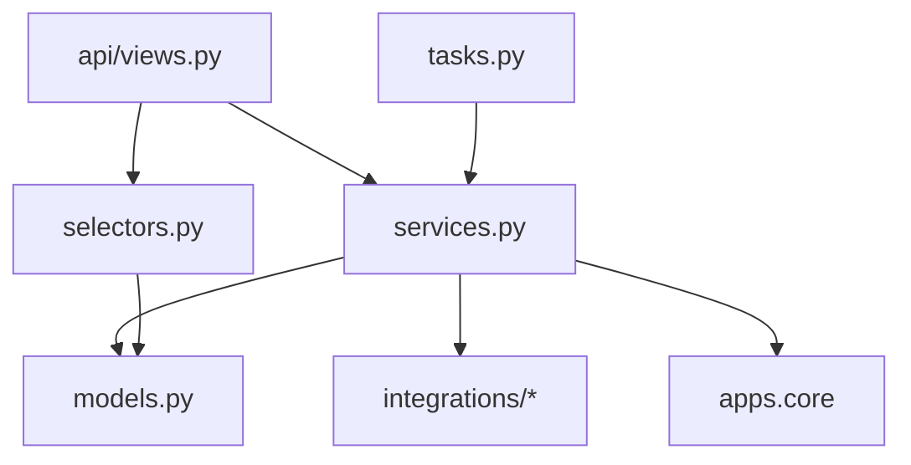

# Backend architecture

Python 3.13, Django 5.2 LTS, Django REST Framework, drf-spectacular, Celery, PostgreSQL 17, Redis.
Dependencies are managed with `uv`.

## Project layout

```
backend/
├── pyproject.toml          # dependencies + ruff, mypy, pytest, import-linter config
├── manage.py
├── config/
│   ├── settings/base.py    # shared defaults, reads env with django-environ
│   ├── settings/local.py   # DEBUG, local S3 profile
│   ├── settings/test.py    # fast password hasher, in-memory storage adapter, eager Celery
│   ├── settings/production.py
│   ├── urls.py             # /api/v1/, /admin/, /healthz
│   ├── celery.py
│   └── wsgi.py
├── apps/
│   ├── core/               # shared building blocks, no domain logic
│   ├── accounts/           # User, login/logout/me
│   └── crews/              # Crew, Member, Invite, rotation
├── integrations/
│   └── storage/            # ObjectStorage ABC, S3ObjectStorage, InMemoryObjectStorage, factory
└── tests/
    ├── conftest.py
    └── factories/
```

## Layers inside an app

```
apps/crews/
├── models.py        # fields, constraints, small computed properties
├── services.py      # writes: create_crew_with_admin, create_invite, accept_invite, reorder_rotation
├── selectors.py     # reads: get_member_for_user, list_members, next_proposer
├── api/
│   ├── serializers.py
│   ├── views.py
│   └── urls.py
├── admin.py
├── tasks.py
├── migrations/
└── tests/
```



### Rules

1. **Views are thin.** Validate input with a serializer, call one service or selector, serialize
   the result. No ORM writes, no business decisions.
2. **Services own every write and rule.** Keyword-only, typed arguments; return model instances or
   small dataclasses; wrap multi-step writes in `transaction.atomic()`.
3. **Selectors own non-trivial reads.** They return querysets or lists with the right
   `select_related` / `prefetch_related` so views never cause N+1 queries.
4. **Apps talk through services and selectors,** never by writing another app's models.
5. **Integrations are adapters.** An abstract base class defines what the app needs; concrete
   classes implement it; a factory picks one from settings. Only `integrations/` imports `boto3`
   or `pywebpush`.
6. **Tasks are thin and idempotent.** They take ids, load objects, and call one service.

### import-linter contracts (added in M1.2)

```toml
[tool.importlinter]
root_packages = ["apps", "integrations", "config"]

[[tool.importlinter.contracts]]
name = "Services and selectors do not depend on the API layer"
type = "forbidden"
source_modules = ["apps.*.services", "apps.*.selectors", "apps.*.models"]
forbidden_modules = ["apps.*.api"]

[[tool.importlinter.contracts]]
name = "Only integrations talk to external SDKs"
type = "forbidden"
source_modules = ["apps"]
forbidden_modules = ["boto3", "botocore", "pywebpush"]

[[tool.importlinter.contracts]]
name = "Core does not depend on domain apps"
type = "forbidden"
source_modules = ["apps.core"]
forbidden_modules = ["apps.accounts", "apps.crews", "apps.challenges", "apps.checkins", "apps.media", "apps.doom", "apps.notifications"]
```

## Core building blocks (`apps/core`)

| Module | Provides |
|---|---|
| `models.py` | `TimeStampedModel` (UUID pk, `created_at`, `updated_at`), `CrewScopedModel` (adds `crew` FK, manager with `.for_crew(crew)`) |
| `clock.py` | `now()` and `crew_today(crew)` - the only source of "current time" for business logic |
| `errors.py` | `DomainError(code, message, fields=None)` and subclasses: `NotFound`, `PermissionDenied`, `Conflict`, `ValidationFailed` |
| `exception_handler.py` | DRF handler that turns every error into the standard error shape |
| `permissions.py` | `IsCrewMember`, `IsCrewAdmin` |
| `middleware.py` | Sets `request.member` for the authenticated user's current crew |
| `pagination.py` | Cursor pagination with `{results, next}` |
| `views.py` | `/healthz` (checks database and Redis) |

## Example: a service and its view

```python
# apps/crews/services.py
from django.db import transaction

from apps.core import clock
from apps.core.errors import Conflict
from .models import Invite, Member


class InviteExpired(Conflict):
    code = "invite_expired"
    message = "This invite link has expired. Ask for a new one."


@transaction.atomic
def accept_invite(*, code: str, username: str, password: str, display_name: str) -> Member:
    invite = Invite.objects.select_for_update().get(code=code)
    if invite.used_at or invite.expires_at <= clock.now():
        raise InviteExpired()
    ...
```

```python
# apps/crews/api/views.py
class AcceptInviteView(APIView):
    permission_classes = [AllowAny]

    @extend_schema(request=AcceptInviteIn, responses={201: MemberOut})
    def post(self, request, code: str):
        data = validate(AcceptInviteIn, request.data)
        member = services.accept_invite(code=code, **data)
        login(request, member.user)
        return Response(MemberOut(member).data, status=201)
```

## Settings

- `django-environ` reads `.env`. Every variable is documented in `.env.example`.
- `base.py` holds defaults; `local.py`, `test.py`, and `production.py` override.
- Production enforces `SECURE_*` settings, `SESSION_COOKIE_SECURE`, `CSRF_COOKIE_SECURE`,
  `SESSION_COOKIE_AGE` of one year, and `SameSite=Lax`.

## Testing

- `pytest` with `pytest-django`, running against Postgres.
- `factory-boy` factories live in `backend/tests/factories/`, one module per app.
- `time-machine` freezes time for date logic. Always include a DST transition case for anything
  that computes crew-local days (Moldova switches on the last Sundays of March and October).
- Service tests (`test_services.py`) cover rules and edge cases. API tests (`test_api.py`) cover
  status codes, permissions, and the response shape.
- AWS is mocked with moto or replaced by `InMemoryObjectStorage`. Tests never reach real AWS.
