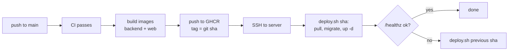

# Environments

Two stages: **local** (your machine) and **production** (one Amazon Lightsail instance).
Both run the same backend Docker image; only configuration differs.

## Comparison

| Concern | Local | Production |
|---|---|---|
| Start | `make dev` (`compose.yaml`) | `infra/scripts/deploy.sh` (`compose.prod.yaml`) |
| Frontend | Vite dev server, hot reload, port 5173 | Built files served by Caddy |
| Backend | `runserver`, code mounted, auto-reload | gunicorn, 3 workers |
| Celery | worker + beat containers | worker + beat containers |
| Database | Postgres 17 container, named volume | Postgres 17 container on the instance SSD; nightly `pg_dump` to `cc-prod-backups` (14 days) |
| Redis | container | container |
| Media storage | real S3 bucket `cc-dev-media`; tests use moto | S3 bucket `cc-prod-media` + CloudFront |
| Transcoding | MediaConvert, from the dev bucket | MediaConvert |
| AWS credentials | your AWS CLI profile `cc-dev` (dev bucket only) | least-privilege IAM user key in the root-only `/opt/cc/.env` |
| Secrets | `.env` from `.env.example` | `/opt/cc/.env`, written by hand, `chmod 600` |
| HTTPS | not needed (localhost is a secure context) | Caddy with automatic Let's Encrypt certificates |
| Phone testing | `make tunnel` (temporary HTTPS URL) | real domain |
| Settings module | `config.settings.local` | `config.settings.production` |
| Container images | built locally | built by GitHub Actions, pushed to GitHub Container Registry |
| Deploys | - | GitHub Actions -> SSH -> `deploy.sh <git-sha>` |

## Why a real S3 dev bucket

Browser multipart uploads depend on CORS, the `ETag` header, and presigned URL details. Emulators
differ exactly there. A dev bucket costs cents per month.

## Production host

- Lightsail Linux instance, 2 GB RAM / 2 vCPU / 60 GB SSD plan, Ubuntu 24.04, static IP.
- Firewall: 80 and 443 open; 22 open with key-only SSH (password login disabled, fail2ban on).
  GitHub Actions connects with a dedicated deploy key that can only run `deploy.sh`.
- `infra/scripts/bootstrap-host.sh` installs Docker, creates `/opt/cc`, a `deploy` user, and a
  nightly backup cron. It is pasted as the instance's launch script.
- Automatic Lightsail snapshots are optional extra protection for the whole disk.

## Deploy flow

- `deploy.sh` is idempotent and stores the current sha in `/opt/cc/current_sha`.
- Migrations run in a one-off container before new app containers start, and must stay compatible
  with the previous release (add first, remove in a later release).

## AWS resources

Created by hand in the AWS console by the owner. The JSON documents pasted into the console
(CORS, lifecycle rules, IAM policies) live in `infra/aws/`.

| Resource | Purpose |
|---|---|
| Lightsail instance + static IP | Runs the app |
| S3 `cc-dev-media` | Local development uploads |
| S3 `cc-prod-media` | Production originals and HLS renditions |
| S3 `cc-prod-backups` | Nightly database dumps, 14-day expiry |
| CloudFront distribution | Media playback with signed cookies |
| MediaConvert role | Lets MediaConvert read and write the media bucket |
| IAM user `cc-prod-app` | Server credentials: media + backups buckets, MediaConvert, pass role |
| IAM user or profile `cc-dev` | Your local credentials: dev bucket + MediaConvert in dev only |
| DNS record | Your domain -> the static IP |
