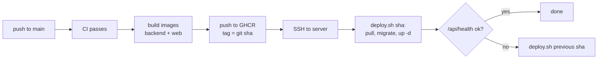

# Environments

Two stages: **local** (your machine) and **production** (one Amazon Lightsail instance).
Both run the same backend Docker image; only configuration differs.

## Comparison

| Concern | Local | Production |
|---|---|---|
| Start | `make dev` (`compose.yaml`) | `infra/scripts/deploy.sh` (`compose.prod.yaml`) |
| Frontend | Vite dev server, hot reload, port 5173 | Built files served by Caddy |
| Backend | `runserver`, code mounted, auto-reload | gunicorn, 3 workers |
| Celery | worker + beat containers | worker + beat containers |
| Database | Postgres 17 container, named volume | Postgres 17 container on the instance SSD; nightly `pg_dump` to `cc-prod-backups` (14 days) |
| Redis | container | container |
| Media storage | real S3 bucket `cc-dev-media`; tests use an in-memory fake | S3 bucket `cc-prod-media` + CloudFront |
| Transcoding | MediaConvert, from the dev bucket | MediaConvert |
| AWS credentials | your AWS CLI profile `cc-dev` (dev bucket only) | least-privilege IAM user key in the root-only `/opt/cc/.env` |
| Secrets | `.env` from `.env.example` | `/opt/cc/.env`, written by hand, `chmod 600` |
| HTTPS | not needed (localhost is a secure context) | Caddy with automatic Let's Encrypt certificates |
| Phone testing | `make tunnel` (temporary HTTPS URL) | real domain |
| Settings module | `config.settings.local` | `config.settings.production` |
| Container images | built locally | built by GitHub Actions, pushed to GitHub Container Registry |
| Deploys | - | GitHub Actions -> SSH -> `deploy.sh <git-sha>` |

## Local development

`compose.yaml` runs the whole app. `make setup` once (creates `.env`, builds images, migrates,
loads the demo crew), then `make dev`. It starts the containers in the background and returns when
every service is healthy (or fails and says so). `make logs` follows the output, `make stop` stops it.

| Service | What it runs | Port on localhost |
|---|---|---|
| `db` | Postgres 17, data in the `pgdata` volume | 5432 (`POSTGRES_PORT`) |
| `redis` | Redis 7 (Celery broker, results, cache) | 6379 (`REDIS_PORT`) |
| `migrate` | `manage.py migrate`, then exits; the services below wait for it | - |
| `backend` | `runserver`, `backend/` mounted, reloads on save | 8000 |
| `worker` | Celery worker (restart it after changing a task) | - |
| `beat` | Celery beat, schedules in the database | - |
| `frontend` | Vite dev server, `frontend/` mounted, hot reload | 5173 |
| `preview` | Production build of the frontend, only with `make preview` | 4173 |
| `tunnel` | Cloudflare quick tunnel, only with `make tunnel` or `make preview` | - |

- Ports are published on 127.0.0.1 only. Postgres and Redis are published so `make check` and
  `make e2e` can run from your machine against the same containers.
- `.env` holds addresses as seen from your machine (`localhost`); compose overrides them with the
  service names inside the containers. So the same `.env` works for both.
- The backend containers mount `~/.aws` read-only; `AWS_PROFILE` in `.env` picks the profile.
- `frontend/node_modules` inside the container is a volume with Linux packages; it never mixes with
  the one on your machine. A changed `pnpm-lock.yaml` is installed when the container starts.
- A changed `uv.lock` is picked up because `make dev` rebuilds the image (cached when nothing changed).

### Testing on a phone

A phone reaches your machine only through a non-localhost address, and browsers allow service
workers, installing, push and the camera there only over HTTPS. Two commands print a temporary
`https://<random>.trycloudflare.com` URL to open on the phone (it changes every run, and anyone with
it reaches your local app, so do not share it):

| Command | Serves | Use it for |
|---|---|---|
| `make tunnel` (after `make dev`) | Vite dev server, hot reload | Layout and flows while you edit; not installable (no service worker in dev) |
| `make preview` | Production build on port 4173, rebuilt each run | Installing, offline start, update banner. Run it again after changes |

An app installed from a tunnel URL stops working when that tunnel ends; uninstall it before the next test.
Local settings trust `*.trycloudflare.com` for hosts and CSRF. Invite links still use
`APP_PUBLIC_URL`; set it to the tunnel URL in `.env` and restart the backend to test joining from a phone.
Production refuses to start unless `APP_PUBLIC_URL` is the public `https://` address (not localhost),
so invite links never point at a developer machine.

### Troubleshooting

- "port is already allocated": something else uses 5432, 6379, 8000 or 5173 (often a Postgres
  installed on your machine). Stop it, or change `POSTGRES_PORT` / `REDIS_PORT` and the matching URLs
  in `.env`.
- Start from an empty database: `docker compose down -v` (deletes the database volume), then `make setup`.
- A container is unhealthy: `make ps`, then `make logs s=<service>`.

## Why a real S3 dev bucket

Browser multipart uploads depend on CORS, the `ETag` header, and presigned URL details. Emulators
differ exactly there. A dev bucket costs cents per month. `make upload-smoke` uploads through the
real adapter like the browser does and checks those details; the bucket setup is in `infra/aws/`.

## Production host

- Lightsail Linux instance, 2 GB RAM / 2 vCPU / 60 GB SSD plan, Ubuntu 24.04, static IP.
- Firewall: 80 and 443 open; 22 open with key-only SSH (password login disabled, fail2ban on).
  GitHub Actions connects with a dedicated deploy key that can only run `deploy.sh`.
- `infra/scripts/bootstrap-host.sh` installs Docker, creates `/opt/cc`, a `deploy` user, and a
  nightly backup cron. It is pasted as the instance's launch script.
- Automatic Lightsail snapshots are optional extra protection for the whole disk.

## Deploy flow

- `deploy.sh` is idempotent and stores the current sha in `/opt/cc/current_sha`.
- Migrations run in a one-off container before new app containers start, and must stay compatible
  with the previous release (add first, remove in a later release).

## AWS resources

Created by hand in the AWS console by the owner. The JSON documents pasted into the console
(CORS, lifecycle rules, IAM policies) live in `infra/aws/`.

| Resource | Purpose |
|---|---|
| Lightsail instance + static IP | Runs the app |
| S3 `cc-dev-media` | Local development uploads |
| S3 `cc-prod-media` | Production originals and HLS renditions |
| S3 `cc-prod-backups` | Nightly database dumps, 14-day expiry |
| CloudFront distribution | Media playback with signed cookies |
| MediaConvert role | Lets MediaConvert read and write the media bucket |
| IAM user `cc-prod-app` | Server credentials: media + backups buckets, MediaConvert, pass role |
| IAM user or profile `cc-dev` | Your local credentials: dev bucket + MediaConvert in dev only |
| DNS record | Your domain -> the static IP |
