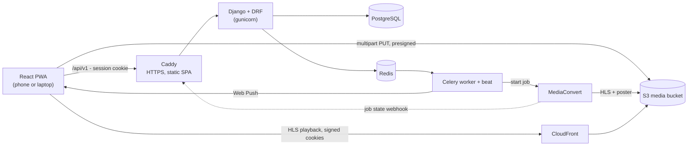

# Architecture overview

Crew Challenges is a monorepo with a Django API, a React PWA, and a small amount of hand-made AWS
infrastructure. This page is the map; the other pages in this folder go deeper.

- [Backend](backend.md) - Django apps, layers, conventions
- [Frontend](frontend.md) - features, state, motion, PWA
- [API conventions](api-conventions.md) - the contract between them
- [Environments](environments.md) - local and production

## System

Everything inside the Lightsail instance runs in Docker Compose: Caddy, Django (gunicorn),
Celery worker, Celery beat, Redis, and Postgres. Video bytes never pass through the instance.

## Key flows

**Login and API calls.** The SPA and API share one origin. The SPA gets a CSRF cookie, logs in to
receive a session cookie, then calls `/api/v1/*` with `X-CSRFToken` on unsafe requests.
See [API conventions](api-conventions.md).

**Proof upload (M2).** The phone creates a check-in (`uploading`), asks the API to start an S3
multipart upload, uploads parts directly to S3 with presigned URLs, reports each part's ETag, and
completes. Django verifies the object and a Celery task starts a MediaConvert job. MediaConvert
calls back when renditions are ready.

**Midnight judgment (M3).** Celery beat runs idempotent jobs in each crew's time zone: mark missed
days, expire stuck uploads, reset streaks, create pending spins, send push notifications.

## Where code goes

| Change | Location |
|---|---|
| A business rule | `backend/apps/<app>/services.py` |
| A query used by more than one view | `backend/apps/<app>/selectors.py` |
| A new endpoint | `backend/apps/<app>/api/` + `make schema` |
| Anything that talks to AWS or push services | `backend/integrations/<name>/` |
| A screen | `frontend/src/features/<name>/routes/` |
| A reusable UI piece | `frontend/src/shared/ui/` |
| A decision that changes the architecture | `docs/adr/` |

## Decisions

All architecture decisions are recorded in [`docs/adr/`](../adr/README.md).
