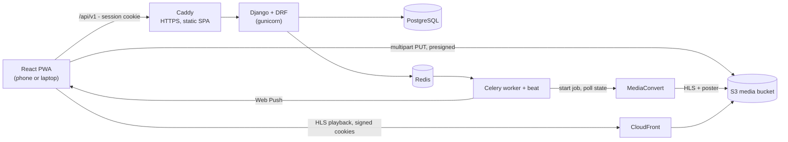

# Architecture overview

Crew Challenges is a monorepo with a Django API, a React PWA, and a small amount of hand-made AWS
infrastructure. This page is the map; the other pages in this folder go deeper.

- [Backend](backend.md) - Django apps, layers, conventions
- [Frontend](frontend.md) - features, state, motion, PWA
- [API conventions](api-conventions.md) - the contract between them
- [Environments](environments.md) - local and production

## System

Everything inside the Lightsail instance runs in Docker Compose: Caddy, Django (gunicorn),
Celery worker, Celery beat, Redis, and Postgres. Video bytes never pass through the instance.

## Key flows

**Login and API calls.** The SPA and API share one origin. The SPA gets a CSRF cookie, logs in to
receive a session cookie, then calls `/api/v1/*` with `X-CSRFToken` on unsafe requests.
See [API conventions](api-conventions.md).

**Proof upload.** After checking in, the phone adds proof to the check-in. A photo (shrunk on
the phone) goes up with one presigned PUT; a video as an S3 multipart upload: parts go directly to
S3 with presigned URLs and each part's ETag is reported, so a closed app can resume. On complete
Django verifies the object's size and a Celery task starts a MediaConvert job, then polls it
every 20 seconds until the renditions are ready. MediaConvert captures a frame a second for the
first 5 seconds and Django keeps the one with the most detail (the biggest JPEG: videos often
start black) as the poster; when all are blank, the phone's own thumbnail stays, and the browser
falls back to it whenever a poster fails to load. Uploads that miss their grace are expired by a
Celery job. The crew watches through CloudFront, which one set of signed cookies opens per crew.

**Midnight judgment.** Celery beat runs idempotent jobs in each crew's time zone: mark missed
days, expire stuck uploads, reset streaks, create pending spins, send push notifications.

## Where code goes

| Change | Location |
|---|---|
| A business rule | `backend/apps/<app>/services.py` |
| A query used by more than one view | `backend/apps/<app>/selectors.py` |
| A new endpoint | `backend/apps/<app>/api/` + `make schema` |
| Anything that talks to AWS or push services | `backend/integrations/<name>/` |
| A screen | `frontend/src/features/<name>/routes/` |
| A reusable UI piece | `frontend/src/shared/ui/` |
| A change to how the system is built | the matching page in `docs/architecture/`, in the same change |

## Key decisions

| Decision | Why |
|---|---|
| Monorepo with `AGENTS.md`, recipes, and `make check` as the single gate | Coding agents can start cold and verify their own work |
| Django apps split into services, selectors, and thin API views | One obvious place for each kind of code; views and Celery tasks share the same services |
| Session cookie + CSRF on a single origin, no JWT | No token storage or refresh flow in the browser, no CORS for the API |
| OpenAPI contract with a generated TypeScript client | Frontend/backend drift becomes a compile error |
| Real S3 dev bucket instead of an emulator | Multipart uploads depend on CORS and `ETag` details that emulators get wrong |
| One Lightsail instance with Docker Compose, Postgres in a container with nightly backups | About $20/month; moving to a managed database later is a dump, a restore, and one setting |
| MediaConvert for video | Video bytes never touch the small app server; quality does not depend on its size |
| MediaConvert jobs polled by Celery, settings in code | Nothing public to secure (no webhook); the job settings are reviewed and versioned with the code |
| AWS resources created by hand, JSON kept in `infra/aws/` | Small one-time setup; no infrastructure tool to maintain |
| PWA instead of native apps | One codebase for iPhone and Android, no app store; iOS limits are designed around |
| "Crew" as the name of a group | Works for families, friends, and teams; `Group` clashes with Django |
